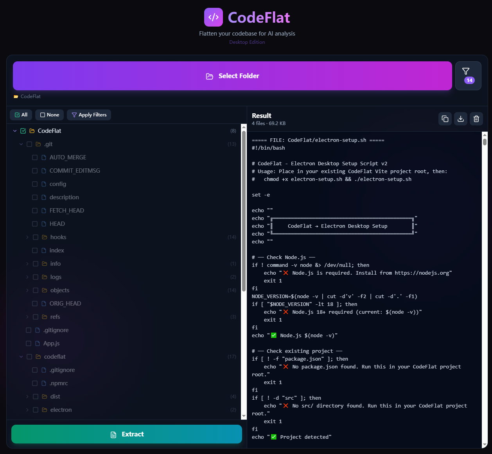

# CodeFlat

<p align="center">
  
  
  
  
  
</p>

**CodeFlat** is a tool that flattens your codebase into a single text file, perfect for AI analysis, code reviews, or documentation purposes. It runs entirely locally — your code never leaves your machine.

Available as a **browser-based web app** or a **cross-platform desktop app** (Windows / macOS / Linux).
<p align="center">
  
</p>
## ✨ Features

- **🔒 Privacy First** - All processing happens locally
- **🎯 Smart Auto-Filtering** - Automatically excludes common non-essential files (`node_modules`, `__pycache__`, `.git`, etc.)
- **📁 Interactive File Tree** - Visual selection with expand/collapse functionality
- **⚡ Batch Processing** - Efficiently handles large codebases
- **📋 Multiple Export Options** - Copy to clipboard or download as file
- **🎨 Modern UI** - Clean, responsive dark-themed interface
- **🔧 Customizable Filters** - Add or remove filter rules as needed
- **🖥️ Desktop App** - Native folder dialog, Save As, offline — via Electron

## 📋 Prerequisites

- **Node.js** (v18.0.0 or higher)
- **npm** (v9.0.0 or higher) - comes with Node.js

```bash
node --version   # Should output v18.x.x or higher
npm --version    # Should output 9.x.x or higher
```

---

## 🚀 Web App Deployment

### Option 1: One-Click Setup (Recommended)

```bash
chmod +x setup.sh
./setup.sh
cd codeflat
npm run dev
```

> **Windows**: Run via Git Bash or WSL. See [Platform-Specific Notes](#-platform-specific-notes) below.

### Option 2: Manual Installation

```bash
# 1. Create project
npm create vite@latest codeflat -- --template react
cd codeflat

# 2. Install dependencies
npm install
npm install lucide-react
npm install -D tailwindcss@3 postcss autoprefixer
npx tailwindcss init -p

# 3. Configure Tailwind (tailwind.config.js)
# 4. Configure CSS (src/index.css)
# 5. Replace src/App.jsx with provided App.js
# 6. Start dev server
npm run dev
```

Open `http://localhost:5173` in your browser.

---

## 🖥️ Desktop App (Electron)

Convert CodeFlat into a standalone desktop application with native OS integration.

### One-Click Setup

After deploying the web app (via `setup.sh`), run:

```bash
# In your codeflat project directory
chmod +x electron-setup.sh
./electron-setup.sh
```

The script will ask two questions:

| Question | Options |
|----------|---------|
| **Native folder dialog?** | `[1]` Yes (recommended) — system file picker, Save As dialog |
|  | `[2]` No — keep browser-style `webkitdirectory` picker |
| **Download mirror?** | `[1]` Default (GitHub) — international networks |
|  | `[2]` China mirror (npmmirror) — much faster in mainland China |

### What the script does

- Creates `electron/` directory with main process and preload files
- Auto-detects `"type": "module"` projects and uses `.cjs` extensions
- Configures Vite for Electron compatibility (`base: './'`)
- Updates `package.json` with Electron scripts and build config
- Optionally replaces `App.jsx` with native dialog version (original backed up)
- Installs Electron dependencies

### Commands after setup

```bash
# Development mode (hot-reload)
npm run dev

# Test production build
npm run build
npx cross-env NODE_ENV=production electron .

# Package for distribution
npm run dist:win      # → release/win-unpacked/CodeFlat.exe
npm run dist:mac      # → release/CodeFlat.dmg
npm run dist:linux    # → release/CodeFlat.AppImage
```

### Web vs Desktop comparison

| Feature | Web | Desktop |
|---------|-----|---------|
| Folder selection | Browser `webkitdirectory` | Native OS dialog |
| File reading | File API (in-memory) | Node.js `fs` (streaming) |
| Save/export | Browser download | Native "Save As" dialog |
| Distribution | Deploy to URL | `.exe` / `.dmg` / `.AppImage` |
| Offline use | Needs hosting | Fully offline |

---

## 🖥️ Platform-Specific Notes

### Windows

```bash
# Using Git Bash (Recommended)
cd codeflat
npm run dev
```

> If you encounter permission issues, run your terminal as Administrator.

### macOS

```bash
cd codeflat
npm run dev
```

> Permission errors? Fix with: `sudo chown -R $(whoami) ~/.npm`

### Linux (Ubuntu/Debian)

```bash
cd codeflat
npm run dev
```

> Install Node.js via NodeSource if needed:
> ```bash
> curl -fsSL https://deb.nodesource.com/setup_20.x | sudo -E bash -
> sudo apt-get install -y nodejs
> ```

### Linux (Fedora/RHEL)

```bash
sudo dnf install nodejs npm
cd codeflat
npm run dev
```

---

## 🏗️ Production Build

### Web (static files)

```bash
npm run build
# Serve the dist/ directory with any static server:
npx serve -s dist
```

### Desktop (packaged app)

```bash
npm run dist:win      # Windows
npm run dist:mac      # macOS
npm run dist:linux    # Linux
```

Output in `./release/` directory. The `win-unpacked/` folder can be zipped and distributed directly.

---

## 🐳 Docker Deployment (Optional)

```dockerfile
FROM node:20-alpine AS build
WORKDIR /app
COPY package*.json ./
RUN npm ci
COPY . .
RUN npm run build

FROM nginx:alpine
COPY --from=build /app/dist /usr/share/nginx/html
EXPOSE 80
CMD ["nginx", "-g", "daemon off;"]
```

```bash
docker build -t codeflat .
docker run -p 8080:80 codeflat
```

---

## 📖 Usage Guide

1. **Select Folder** - Click "Select Folder" and choose your project directory
2. **Configure Filters** - Click the filter icon to manage auto-exclude rules
3. **Select Files** - Use checkboxes to include/exclude specific files or folders
4. **Extract** - Click "Extract" to generate the flattened output
5. **Export** - Copy to clipboard or download/save as a text file

### Default Filter Rules

| Pattern | Description |
|---------|-------------|
| `__pycache__` | Python bytecode cache |
| `.venv` / `venv` | Python virtual environments |
| `.git` | Git repository data |
| `.gitignore` | Git ignore file |
| `.idea` | JetBrains IDE settings |
| `.env` | Environment variables |
| `node_modules` | Node.js dependencies |
| `.DS_Store` | macOS folder metadata |
| `.vscode` | VS Code settings |
| `dist` / `build` | Build output directories |
| `*.pyc` | Compiled Python files |
| `.cache` | Cache directories |

### Custom Filters

- Click the **Filter** button to open the filter panel
- Add new patterns (e.g., `*.log`, `temp`, `.myconfig`)
- Use `*.ext` syntax to match file extensions
- Click **×** on any tag to remove a filter
- **Reset** restores default filters
- **Clear All** disables all auto-filtering

---

## 🔧 Troubleshooting

### Common Issues

**"npm: command not found"**
- Ensure Node.js is installed and in your PATH
- Restart your terminal after installation

**"EACCES: permission denied"**
- Linux/macOS: Fix npm permissions or use nvm
- Windows: Run terminal as Administrator

**Port 5173 already in use**
```bash
npm run dev -- --port 3000
```

**Folder selection not working (web)**
- Use a modern browser (Chrome, Firefox, Edge)
- `webkitdirectory` may not work in all browsers

**Electron white screen**
- Ensure `vite.config.js` has `base: './'`
- Rebuild: `npm run build`
- Check DevTools (`Ctrl+Shift+I`) for errors

**Electron `require is not defined` error**
- Your project has `"type": "module"` in `package.json`
- Re-run `electron-setup.sh` — it auto-detects this and uses `.cjs` extensions

---

## 📄 License

This project is licensed under the MIT License.

---

## 🤝 Contributing

Contributions are welcome! Please feel free to submit a Pull Request.

1. Fork the repository
2. Create your feature branch (`git checkout -b feature/amazing-feature`)
3. Commit your changes (`git commit -m 'Add amazing feature'`)
4. Push to the branch (`git push origin feature/amazing-feature`)
5. Open a Pull Request